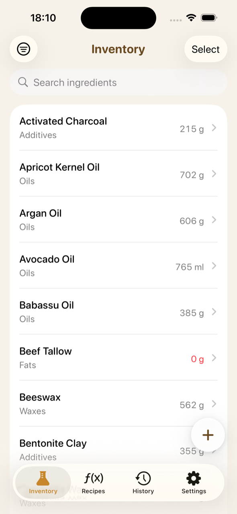
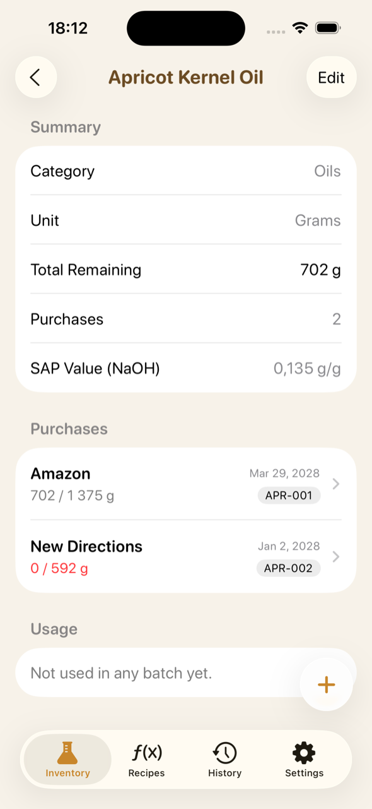
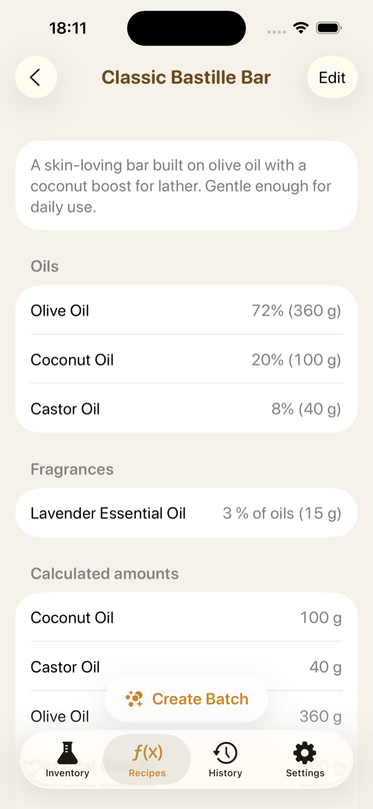
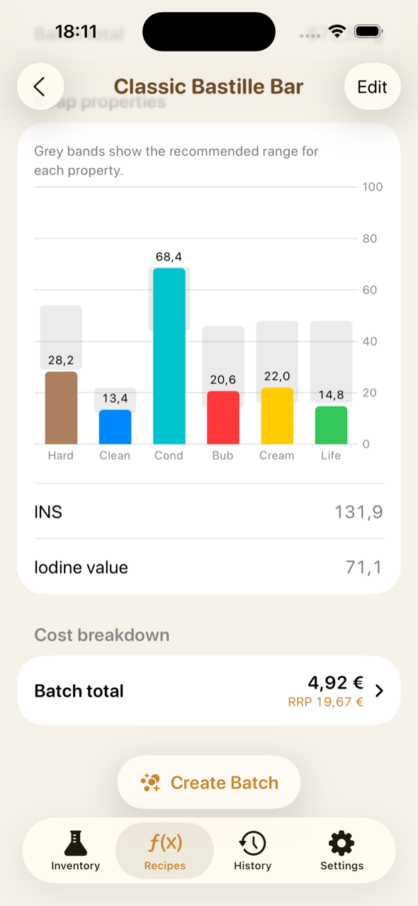
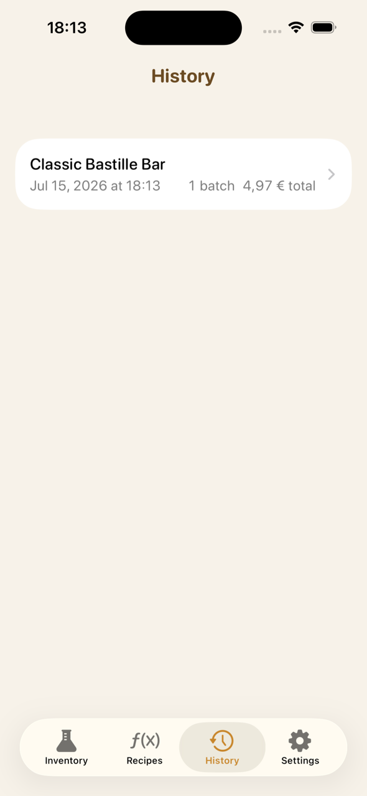
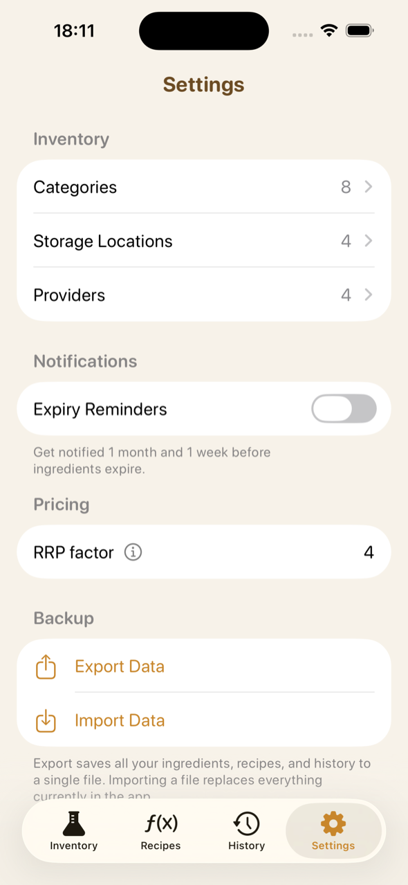

# 🧼 SoapWiz

An iOS app for artisan soap makers — manage your ingredient inventory, formulate recipes with automatic lye calculation, and track every production batch with real costs.

Built with **Swift, SwiftUI, and SwiftData**, targeting **iOS 18+** (with iOS 26 Liquid Glass refinements where available). No external dependencies.

## Features

### 🧪 Ingredient inventory
Track every ingredient with per-purchase granularity: each purchase keeps its own quantity, price, supplier, lot number, and expiry date. Total stock is the sum of what remains across purchases, with low-stock and expiry warnings surfaced right in the list — and optional notifications before ingredients expire.

### ƒ Recipes with soap chemistry
Formulate soap recipes by oil percentages. SoapWiz calculates:

- **Lye amount** (NaOH or KOH, with purity adjustment) from each oil's saponification value
- **Water** by lye ratio and **superfat** discount
- **Fragrance load** as a percentage of oils
- **Soap properties** — hardness, cleansing, conditioning, bubbly/creamy lather, and longevity, derived from fatty-acid profiles and plotted against recommended ranges, plus INS and iodine values
- **Cost breakdown** — real batch cost from your actual purchase prices, with a suggested retail price

Supports cold/hot process bar soap as well as cream soap (Catherine Failor method).

### 📦 Batches
Making a batch deducts ingredients from inventory (oldest purchases first) and records an immutable snapshot of what was consumed and what it cost — your production history stays accurate even if recipes or ingredients change later.

### ⚙️ Settings & data
Manage categories, suppliers, and storage locations. Export the entire database to a single file and import it back — manual backup and restore, no account needed.

## Screenshots

| Inventory | Ingredient detail | Recipe |
|:---:|:---:|:---:|
|  |  |  |

| Soap properties & cost | Batch history | Settings |
|:---:|:---:|:---:|
|  |  |  |

## Architecture

- **SwiftUI + SwiftData**, MVVM: one `@Observable @MainActor` ViewModel per screen
- Four-tab root (`Inventory · Recipes · History · Settings`), navigation state centralized in an `@Observable` object injected through the environment
- Full main-actor isolation (`SWIFT_DEFAULT_ACTOR_ISOLATION = MainActor`), Swift Concurrency throughout
- Unit tests with **Swift Testing** against in-memory `ModelContainer`s; SwiftLint `--strict` enforced in CI
- Adaptive layouts for iPhone and iPad

## Building

Requires Xcode 16+.

```bash
open SoapWiz.xcodeproj
```

Or from the command line:

```bash
xcodebuild -project SoapWiz.xcodeproj \
  -scheme SoapWiz \
  -destination 'platform=iOS Simulator,name=iPhone 15 Pro' \
  build
```

In DEBUG builds, a data seeder populates an empty store with demo data on first launch.

## License

This source is published for portfolio review only. No license is granted — all rights reserved.
